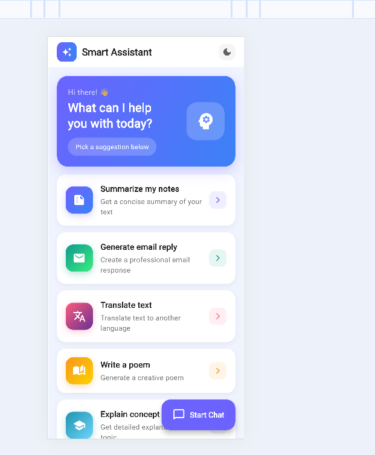
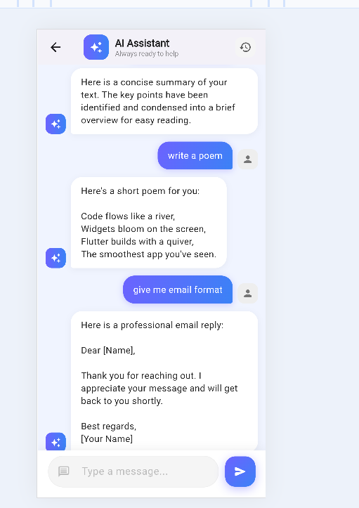
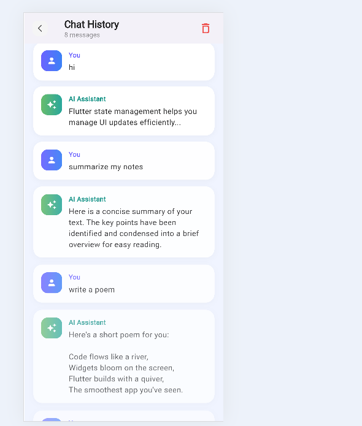

# Smart Assistant Flutter App

A Flutter app that simulates a smart assistant with suggestions, chat interaction and chat history.

## Features

• Suggestions list with pagination  
• Chat with assistant  
• Chat history  
• Dark mode  
• Offline storage using Hive  
• Clean architecture (Repository pattern)

## Tech Stack

Flutter | Provider State Management | HTTP API Integration | Hive Local Database

## Setup

### Prerequisites
- Flutter SDK (version 3.0 or higher)
- Dart SDK (version 2.17 or higher)
- Android Studio / Xcode (for emulator/device testing)

### Installation Steps

1. **Clone the Repository**
   ```bash
   git clone https://github.com/varsha-engineer/smart_assistance_app-main.git
   cd smart_assistance_app
   ```

2. **Install Dependencies**
   ```bash
   flutter pub get
   ```

3. **Run the App**
   ```bash
   flutter run
   ```

### Running on Different Platforms

- **Android**: `flutter run -d android`
- **iOS**: `flutter run -d ios`
- **Web**: `flutter run -d chrome`
- **Windows**: `flutter run -d windows`

## Architecture

### Multi-Layer Architecture

```
┌─────────────────────────────────────┐
│         UI Layer (Widgets)           │
│  (home_screen, chat_screen, etc.)    │
└──────────────────┬──────────────────┘
                   │
┌──────────────────▼──────────────────┐
│      Provider Layer (State)          │
│  (SuggestionProvider, ChatProvider)  │
└──────────────────┬──────────────────┘
                   │
┌──────────────────▼──────────────────┐
│     Repository Layer (Data)          │
│  (AssistantRepository)               │
└──────────────────┬──────────────────┘
                   │
┌──────────────────▼──────────────────┐
│    Service Layer (API & Local DB)    │
│  (ApiService, Hive Box)              │
└─────────────────────────────────────┘
```

### Data Flow

1. **UI → Provider**: User interactions trigger provider methods
2. **Provider → Repository**: Providers request data from repositories
3. **Repository → Services**: Repositories fetch data from API or local storage
4. **Services → Provider**: Data flows back through the layers
5. **Provider → UI**: Listeners rebuild UI with new data

### Project Structure

```
lib/
├── main.dart
├── core/
│   └── api_service.dart
├── models/
├── providers/
│   ├── chat_provider.dart
│   ├── suggestion_provider.dart
│   ├── history_provider.dart
│   └── theme_provider.dart
├── repositories/
├── screens/
│   ├── home_screen.dart
│   ├── chat_screen.dart
│   └── history_screen.dart
└── widgets/
```

## Screenshots

### Home Screen (Suggestions)
![Home Screen] 
- Paginated suggestions list
- Infinite scroll with loading indicator
- FAB to start chat
- Dark mode toggle in AppBar

### Chat Screen
![Chat Screen]
- Real-time messaging
- User and assistant message bubbles
- Auto-save to history
- Loading indicator

### History Screen
![History Screen] 
- View all conversations
- Delete individual messages
- Organized by timestamp
